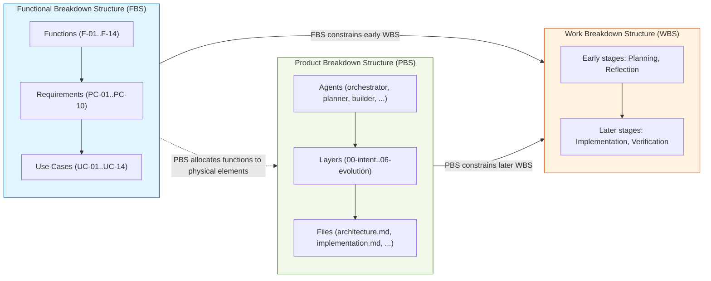

# FBS — PBS — WBS Relationships

This document documents the Functional Breakdown Structure (FBS), Product Breakdown Structure (PBS), and Work Breakdown Structure (WBS) for the `system_dev_harness` System of Interest (SoI), following INCOSE §2.3.4.1 guidance on deriving system functions from requirements, allocating functions to products or services through functional and physical architecture, and basing the WBS on the FBS in early stages and the PBS in later stages.

## FBS — Functional Breakdown Structure

The FBS decomposes the required functions of the SoI into successively lower levels of functional architecture. The top-level functions are derived from use cases (UC-001 through UC-014), and product commitments (PC-001 through PC-010) serve as functional requirement nodes that constrain those functions.

### Top-Level Functions

| Function ID | Function Name | Description | Derived From |
|---|---|---|---|
| F-01 | Request Normalization | Transform a rough instruction into a concrete, normalized task shape. | UC-001 |
| F-02 | Work Order Creation | Produce a binding, checklistable planner-owned work order with objective, scope, requirements, verification criteria, and waiver rules. | UC-002 |
| F-03 | Architecture Preservation | Keep implementation work aligned with current architecture, module boundaries, and approved patterns. | UC-003 |
| F-04 | Mistake Prevention | Check persistent known mistakes before implementation to prevent repeated errors. | UC-004 |
| F-05 | Builder Work Order Production | Generate strict builder instructions with step-by-step guidance, tests, and definition of done. | UC-005 |
| F-06 | Change Implementation | Apply approved changes and collect implementation evidence. | UC-006 |
| F-07 | Implementation Review | Get independent support-agent feedback before treating work as complete. | UC-007 |
| F-08 | Completion Decision | Decide whether a task is approved, blocked, or requires waivers. | UC-008 |
| F-09 | Lesson Capture | Update persistent mistake memory after completed or corrected tasks. | UC-009 |
| F-10 | Final Control Report | Summarize the run in a concise, reviewable report. | UC-010 |
| F-11 | Design Quality Guarding | Actively evaluate modularity, simplicity, readability, and module responsibility during architecture work. | UC-011 |
| F-12 | Continuous Improvement | Run candidate-capture mode to identify and persist backlog improvement candidates. | UC-012 |
| F-13 | Direct Build Execution | Allow operator-chosen build execution outside the guarded orchestrator path. | UC-013 |
| F-14 | Repository State Review | Assess current repository state for freshness, completeness, consistency, and traceability. | UC-014 |

### Functional Requirement Nodes (Sub-Functions)

The product commitments (PC-001 through PC-010) act as functional requirement nodes that constrain sub-functions:

```
FBS Hierarchy:

F-01 (Request Normalization) ─────────────────────────── PC-001, PC-007
F-02 (Work Order Creation) ───────────────────────────── PC-001
F-03 (Architecture Preservation) ─────────────────────── PC-002, PC-008
F-04 (Mistake Prevention) ────────────────────────────── PC-003
F-05 (Builder Work Order Production) ─────────────────── PC-004, PC-007
F-06 (Change Implementation) ─────────────────────────── PC-004, PC-007
F-07 (Implementation Review) ─────────────────────────── PC-002, PC-004
F-08 (Completion Decision) ───────────────────────────── PC-002, PC-005
F-09 (Lesson Capture) ────────────────────────────────── PC-003
F-10 (Final Control Report) ──────────────────────────── PC-006
F-11 (Design Quality Guarding) ───────────────────────── PC-008
F-12 (Continuous Improvement) ────────────────────────── PC-009
F-13 (Direct Build Execution) ────────────────────────── PC-010
F-14 (Repository State Review) ───────────────────────── PC-006
```

### Complete FBS Tree

```
system_dev_harness Functions [FBS Root]
 |
 +-- F-01 Request Normalization [Function]
 |    +-- PC-001 (Anchor to planner-owned work order) [Requirement]
 |    +-- PC-007 (Express behavior via OpenCode agents) [Requirement]
 |
 +-- F-02 Work Order Creation [Function]
 |    +-- PC-001 (Anchor to planner-owned work order) [Requirement]
 |
 +-- F-03 Architecture Preservation [Function]
 |    +-- PC-002 (Make drift visible before completion) [Requirement]
 |    +-- PC-008 (Evaluate modularity and simplicity) [Requirement]
 |
 +-- F-04 Mistake Prevention [Function]
 |    +-- PC-003 (Persistent mistake memory) [Requirement]
 |
 +-- F-05 Builder Work Order Production [Function]
 |    +-- PC-004 (Separate execution from approval) [Requirement]
 |    +-- PC-007 (Express behavior via OpenCode agents) [Requirement]
 |
 +-- F-06 Change Implementation [Function]
 |    +-- PC-004 (Separate execution from approval) [Requirement]
 |    +-- PC-007 (Express behavior via OpenCode agents) [Requirement]
 |
 +-- F-07 Implementation Review [Function]
 |    +-- PC-002 (Make drift visible before completion) [Requirement]
 |    +-- PC-004 (Separate execution from approval) [Requirement]
 |
 +-- F-08 Completion Decision [Function]
 |    +-- PC-002 (Make drift visible before completion) [Requirement]
 |    +-- PC-005 (Block or waive incomplete work) [Requirement]
 |
 +-- F-09 Lesson Capture [Function]
 |    +-- PC-003 (Persistent mistake memory) [Requirement]
 |
 +-- F-10 Final Control Report [Function]
 |    +-- PC-006 (Traceability and artifact lineage) [Requirement]
 |
 +-- F-11 Design Quality Guarding [Function]
 |    +-- PC-008 (Evaluate modularity and simplicity) [Requirement]
 |
 +-- F-12 Continuous Improvement [Function]
 |    +-- PC-009 (Candidate capture through guarded chain) [Requirement]
 |
 +-- F-13 Direct Build Execution [Function]
 |    +-- PC-010 (Preserve orchestrator guardrails) [Requirement]
 |
 +-- F-14 Repository State Review [Function]
      +-- PC-006 (Traceability and artifact lineage) [Requirement]
```

## PBS — Product Breakdown Structure

The PBS decomposes the SoI into its physical architecture: the agents that implement the workflow and the artifacts that document it.

### Agent Hierarchy

```
system_dev_harness [PBS Root]
 |
 +-- Orchestrator [Physical: Router]
 |    +-- Planner [Physical: Work order owner]
 |    |    +-- Discovery Helper [Physical: File finder]
 |    |    +-- Contract Helper [Physical: Requirements writer]
 |    |    +-- Architecture Helper [Physical: Guardrail extractor]
 |    |    +-- Lessons Helper [Physical: Mistake checker]
 |    |
 |    +-- Builder [Physical: Implementation agent]
 |    |    +-- Build Error Resolver [Physical: Diagnostic fixer]
 |    |    +-- Cleanup Helper [Physical: Reference reconciler]
 |    |    +-- Researcher Helper [Physical: External lookup]
 |    |
 |    +-- Reviewer [Physical: Verification coordinator]
 |    |    +-- Verifier [Physical: Focused checker]
 |    |    +-- Review: Architecture [Physical: Architecture auditor]
 |    |    +-- Review: Completeness [Physical: Contract auditor]
 |    |    +-- Review: Lessons [Physical: Mistake auditor]
 |    |    +-- Completion Gate [Physical: Decision router]
 |    |
 |    +-- Reflection [Physical: Memory triage agent]
 |    |    +-- Memory Curator [Physical: Memory writer]
 |    |
 |    +-- Reporter [Physical: Output summarizer]
 |
 +-- Memory System [Physical: Workflow memory]
 |    +-- Memory Helper [Physical: Read-only retriever]
 |    +-- Memory Files (lessons.md, patterns.md) [Physical: Storage]
 |
+-- Product Breakdown [Physical: Source documentation]
       +-- FBS Grouping [Physical: fbs/]
       |    +-- Intent Layer [Physical: fbs/00-intent/]
       |    +-- Product Layer [Physical: fbs/01-product/]
       +-- PBS Grouping [Physical: pbs/]
       |    +-- Architecture Layer [Physical: pbs/02-architecture/]
       |    +-- Implementation Layer [Physical: pbs/03-implementation/]
       +-- Cross-Cutting Grouping [Physical: cross-cutting/]
            +-- Verification Layer [Physical: cross-cutting/04-verification/]
            +-- Operation Layer [Physical: cross-cutting/05-operation/]
            +-- Evolution Layer [Physical: cross-cutting/06-evolution/]
            +-- Root Artifacts [Physical: Root files]
```

### Cross-Reference: PBS to FBS

| PBS Node | Implements FBS Function |
|---|---|---|
| Orchestrator | F-08 (Completion Decision), routing for all functions |
| Planner | F-01 (Request Normalization), F-02 (Work Order Creation), F-03 (Architecture Preservation), F-04 (Mistake Prevention), F-05 (Builder Work Order Production), F-11 (Design Quality Guarding) |
| Builder | F-06 (Change Implementation), F-12 (Continuous Improvement), F-13 (Direct Build Execution) |
| Reviewer + Verifier + Review Helpers | F-07 (Implementation Review), F-08 (Completion Decision), F-14 (Repository State Review) |
| Reflection + Memory Curator | F-04 (Mistake Prevention), F-09 (Lesson Capture) |
| Reporter | F-10 (Final Control Report) |
| Intent Layer (fbs/00-intent/) | F-01 through F-14 (provides functional source) |
| Product Layer (fbs/01-product/) | All functions (provides requirement constraints) |
| Architecture Layer (pbs/02-architecture/) | All functions (provides structural guidance) |
| Implementation Layer (pbs/03-implementation/) | All functions (provides artifact mapping) |
| Verification Layer (cross-cutting/04-verification/) | F-07, F-08, F-14 |
| Evolution Layer (cross-cutting/06-evolution/) | F-12 (Continuous Improvement) |

## WBS — Work Breakdown Structure

The WBS decomposes the work activities required to realize the SoI. Per INCOSE §2.3.4.1, the WBS is based on the FBS in the initial stages of system maturity (requirements definition, functional design) and on the PBS in later stages (implementation, verification, operation).

### Activity Hierarchy

```
system_dev_harness Work [WBS Root]
 |
 +-- W-01 Planning Activities (derived from FBS)
 |    +-- W-01.01 Request Normalization (F-01)
 |    +-- W-01.02 Work Order Creation (F-02)
 |    +-- W-01.03 Architecture Analysis (F-03, F-11)
 |    +-- W-01.04 Mistake Check (F-04)
 |    +-- W-01.05 Builder Work Order Synthesis (F-05)
 |
 +-- W-02 Implementation Activities (derived from PBS)
 |    +-- W-02.01 Agent Definition (PBS: Orchestrator, Planner, etc.)
 |    +-- W-02.02 Prompt/Template Writing (PBS: .opencode/agents/*.md)
 |    +-- W-02.03 Product Breakdown Writing (PBS: product-breakdown/)
 |    +-- W-02.04 Documentation Writing (PBS: docs/)
 |    +-- W-02.05 Configuration Management (PBS: opencode.json)
 |
 +-- W-03 Verification Activities (derived from PBS)
 |    +-- W-03.01 Acceptance Criteria Definition (PBS: 04-verification/)
 |    +-- W-03.02 Test Strategy Definition (PBS: 04-verification/)
 |    +-- W-03.03 Traceability Matrix Maintenance (PBS: 04-verification/)
 |    +-- W-03.04 Horizontal Verification (PBS: per-layer verification/)
 |
 +-- W-04 Review & Gate Activities (derived from FBS + PBS)
 |    +-- W-04.01 Implementation Review (F-07)
 |    +-- W-04.02 Completion Decision (F-08)
 |    +-- W-04.03 Architecture Review (F-03, F-11)
 |    +-- W-04.04 Information Hygiene Check (F-14)
 |    +-- W-04.05 Lesson Review (F-04)
 |
 +-- W-05 Reflection & Memory Activities (derived from FBS)
 |    +-- W-05.01 Memory Incorporation (F-09)
 |    +-- W-05.02 Lesson Persistence (F-09)
 |
 +-- W-06 Reporting Activities (derived from FBS)
 |    +-- W-06.01 Final Report Production (F-10)
 |
 +-- W-07 Continuous Improvement Activities (derived from FBS + PBS)
 |    +-- W-07.01 Candidate Capture (F-12)
 |    +-- W-07.02 Backlog Management (PBS: 06-evolution/)
```

### WBS Transition: FBS-Based to PBS-Based

| System Maturity Stage | WBS Basis | Example Activities |
|---|---|---|
| Requirements Definition | FBS | W-01 (Planning), W-05 (Reflection), W-06 (Reporting) |
| Functional Design | FBS | W-01.03 (Architecture Analysis), W-01.04 (Mistake Check) |
| Physical Implementation | PBS | W-02 (Implementation), W-03 (Verification) |
| Integration & Verification | PBS | W-03 (Verification), W-04 (Review & Gate) |
| Operation & Maintenance | PBS + FBS | W-04, W-05, W-07 (Continuous Improvement) |

## Boundary: FBS vs. PBS

The following table explicitly states which artifacts belong to the FBS vs. the PBS and how the boundary is maintained.

| Artifact | Belongs To | Rationale |
|---|---|---|
| `fbs/00-intent/use-cases.md` (UC-001 through UC-014) | FBS | Describes functional behavior of the system — what the system does, not how it is structured. |
| `fbs/01-product/product-commitments.md` (PC-001 through PC-010) | FBS | Captures durable functional requirements derived from the vision. |
| `pbs/02-architecture/architecture.md` | PBS | Describes the physical architecture: agents, control flow, boundaries, and mechanism storage. |
| `pbs/03-implementation/implementation.md` | PBS | Lists the concrete physical artifacts (files, directories, agent prompts). |
| `cross-cutting/04-verification/` | Cross-cutting (PBS) | Physical verification artifacts; verification itself is a cross-cutting horizontal view across PBS layers. |
| `cross-cutting/05-operation/` | Cross-cutting (PBS) | Physical operational requirements and deployment model. |
| `cross-cutting/06-evolution/` | Cross-cutting (PBS) | Physical improvement lifecycle tracking. |
| Agents (`orchestrator`, `planner`, `builder`, etc.) | PBS | Physical entities that execute work. |
| `breakdown-structures.md` | Cross-cutting | Documents the FBS/PBS/WBS relationship itself; spans all three structures. |
| `product-tree.md` | PBS | Visual representation of the PBS hierarchy. |
| `traceability-map.md` | Cross-cutting | Traces between FBS functions and PBS artifacts. |
| `decision-log.md` | Cross-cutting | Captures decisions that affect both functional and physical architecture. |

### Boundary Maintenance Rules

1. **FBS artifacts** (`fbs/00-intent/`, `fbs/01-product/`) describe what the system does and why. They should not reference file paths, agent names, or physical structure.
2. **PBS artifacts** (`pbs/02-architecture/`, `pbs/03-implementation/`, `cross-cutting/04-verification/`, `cross-cutting/05-operation/`, `cross-cutting/06-evolution/`) describe how the system is physically structured. They should trace back to FBS elements but not duplicate functional descriptions.
3. The **boundary is maintained through traceability links**, not through duplication. Cross-cutting artifacts (`traceability-map.md`, `breakdown-structures.md`, `decision-log.md`) map the relationship without merging the two views.
4. A change to a functional requirement (FBS) must be traceable to the PBS artifacts that implement it. A change to a physical artifact (PBS) must be traceable back to the functional requirement it satisfies.

### Cross-Cutting Layers

The following layers span both FBS and PBS. In the directory layout they live under `cross-cutting/`:

| Layer | How it Crosses |
|---|---|
| **Verification** | Verification criteria are per-PBS-layer horizontal views (architecture verification, implementation verification, etc.), while the overall verification strategy is a cross-cutting concern. |
| **Operation** | Operational requirements (PBS) respond to functional needs (FBS) for availability, reliability, and maintainability. |
| **Evolution** | Improvement candidates (PBS) are derived from functional gaps (FBS); the evolution lifecycle manages both. |
| **Decision Records** | Architectural decisions (AD-*) and implementation decisions (IMD-*) are PBS artifacts; evolution decisions (ED-*) span both FBS and PBS. |

## Relationship Diagram

The following Mermaid diagram shows how the FBS, PBS, and WBS relate to each other.



### ASCII Fallback

```
+============================+       +============================+
|     FBS (Functional)       |       |     PBS (Physical)         |
|                            |       |                            |
|  Functions (F-01..F-14)    |       |  Agents                    |
|    +-- Requirements        |       |    +-- Orchestrator        |
|    |   (PC-01..PC-10)      |       |    +-- Planner             |
|    +-- Use Cases           |       |    +-- Builder             |
|        (UC-01..UC-14)      |       |    +-- Reviewer            |
|                            |       |    +-- ...                 |
|  Describes WHAT the        |       |  Layers                    |
|  system does               |       |    +-- 00-intent/          |
|                            |       |    +-- 02-architecture/    |
|                            |       |    +-- ...                 |
|                            |       |                            |
|                            |       |  Describes HOW the         |
|                            |       |  system is structured      |
+============================+       +============================+
          |                                        |
          |  FBS constrains                       |  PBS constrains
          |  early WBS                            |  later WBS
          v                                        v
+=========================================================+
|               WBS (Work)                                 |
|                                                          |
|  Early stages (FBS-derived):                             |
|    +-- Planning (W-01)                                   |
|    +-- Reflection & Memory (W-05)                        |
|    +-- Reporting (W-06)                                  |
|                                                          |
|  Later stages (PBS-derived):                             |
|    +-- Implementation (W-02)                             |
|    +-- Verification (W-03)                               |
|    +-- Review & Gate (W-04)                              |
|    +-- Continuous Improvement (W-07)                     |
|                                                          |
|  Describes WHAT WORK is done                             |
+=========================================================+

Cross-reference arrows:
  FBS ---> PBS : Functions are allocated to physical agents and layers
  FBS ---> WBS : Early WBS activities derive from functional requirements
  PBS ---> WBS : Later WBS activities derive from physical architecture
```

## Trace Links

- Feeds from: `product-breakdown/fbs/00-intent/use-cases.md` (UC-001 through UC-014), `product-breakdown/fbs/01-product/product-commitments.md` (PC-001 through PC-010), `product-breakdown/pbs/02-architecture/architecture.md` (agent hierarchy), `product-breakdown/pbs/03-implementation/implementation.md` (artifact map), `product-breakdown/product-tree.md` (PBS hierarchy), `.opencode/dev_harness/workflow/agent-boundaries.md` (agent definitions)
- Informs: `product-breakdown/README.md`, `product-breakdown/traceability-map.md`, future WBS planning, `product-breakdown/cross-cutting/06-evolution/wbs.md`
- Satisfies: PC-006 (traceability and artifact lineage)
- Implements: IMP-016
- Informs: `product-breakdown/README.md`, `product-breakdown/traceability-map.md`, future WBS planning
- Satisfies: PC-006 (traceability and artifact lineage)
- Implements: IMP-016