# Product Tree (PBS)

This document provides a formal System Definition Structure (PBS) for the `system_dev_harness` System of Interest (SoI). It follows INCOSE §1.3.5 hierarchy conventions: each element declares its `element_type` (atomic or decomposable) and its parent subordination.

## Mermaid Diagram

```mermaid
graph TD
    SoI["system_dev_harness<br/>(element_type: decomposable)"] --> FBS["fbs (Functional)<br/>(element_type: decomposable)"]
    SoI --> PBS["pbs (Physical)<br/>(element_type: decomposable)"]
    SoI --> CC["cross-cutting<br/>(element_type: decomposable)"]
    SoI --> XL["Root artifacts<br/>(element_type: decomposable)"]

    FBS --> L00["fbs/00-intent<br/>(element_type: decomposable)"]
    FBS --> L01["fbs/01-product<br/>(element_type: decomposable)"]

    L00 --> L00_V["vision.md<br/>(element_type: atomic)"]
    L00 --> L00_UC["use-cases.md<br/>(element_type: atomic)"]

    L01 --> L01_PC["product-commitments.md<br/>(element_type: atomic)"]

    PBS --> L02["pbs/02-architecture<br/>(element_type: decomposable)"]
    PBS --> L03["pbs/03-implementation<br/>(element_type: decomposable)"]

    L02 --> L02_A["architecture.md<br/>(element_type: atomic, sourcing: make)"]
    L02 --> L02_V["verification.md<br/>(element_type: atomic)"]
    L02 --> L02_IC["interface-contracts.md<br/>(element_type: atomic)"]
    L02 --> L02_ASM["agent-state-machines.md<br/>(element_type: atomic)"]
    L02 --> L02_SP["sequence-parametric.md<br/>(element_type: atomic)"]
    L02 --> L02_D["decisions/<br/>(element_type: decomposable)"]
    L02_D --> L02_AD1["AD-001-use-opencode-agent-workflow-for-orchestration.md<br/>(element_type: atomic)"]
    L02_D --> L02_AD2["AD-002-use-versioned-markdown-for-traceable-context.md<br/>(element_type: atomic)"]
    L02_D --> L02_AD3["AD-003-use-structured-handoff-before-code-editing.md<br/>(element_type: atomic)"]
    L02_D --> L02_AD4["AD-004-decline-adding-agent-skills-to-primary-agents.md<br/>(element_type: atomic)"]
    L02_D --> L02_AD5["AD-005-use-fresh-helper-handoffs-for-context-rot.md<br/>(element_type: atomic)"]

    L03 --> L03_I["implementation.md<br/>(element_type: atomic)"]
    L03 --> L03_D["decisions/<br/>(element_type: decomposable)"]
    L03_D --> L03_IMD1["IMD-001-use-versioned-markdown-for-mistake-memory.md<br/>(element_type: atomic)"]
    L03_D --> L03_IMD2["IMD-002-copy-product-breakdown-guidance-into-agent-payload.md<br/>(element_type: atomic)"]
    L03_D --> L03_IMD3["IMD-003-use-repo-local-workflow-memory.md<br/>(element_type: atomic)"]

    CC --> L04["cross-cutting/04-verification<br/>(element_type: decomposable)"]
    CC --> L05["cross-cutting/05-operation<br/>(element_type: decomposable)"]
    CC --> L06["cross-cutting/06-evolution<br/>(element_type: decomposable)"]

    L04 --> L04_AC["acceptance-criteria.md<br/>(element_type: atomic)"]
    L04 --> L04_TS["test-strategy.md<br/>(element_type: atomic)"]
    L04 --> L04_TM["traceability-matrix.md<br/>(element_type: atomic)"]

    L05 --> L05_R["runbook.md<br/>(element_type: atomic)"]
    L05 --> L05_DP["deployment-process.md<br/>(element_type: atomic)"]

    L06 --> L06_RM["README.md<br/>(element_type: atomic)"]
    L06 --> L06_RD["roadmap.md<br/>(element_type: atomic)"]
    L06 --> L06_CL["changelog.md<br/>(element_type: atomic)"]
    L06 --> L06_RS["risks.md<br/>(element_type: atomic)"]
    L06 --> L06_D["decisions/<br/>(element_type: decomposable)"]
    L06_D --> L06_ED1["ED-001-use-evolution-backlog-for-improvement-candidates.md<br/>(element_type: atomic)"]
    L06 --> L06_CAND["candidates/<br/>(element_type: decomposable)"]
    L06 --> L06_DONE["done/<br/>(element_type: decomposable)"]
    L06_DONE --> L06_DIMP001["IMP-001.md<br/>(element_type: atomic)"]
    L06_DONE --> L06_DIMP002["IMP-002.md<br/>(element_type: atomic)"]
    L06_DONE --> L06_DIMP003["IMP-003.md<br/>(element_type: atomic)"]
    L06_DONE --> L06_DIMP004["IMP-004.md<br/>(element_type: atomic)"]
    L06_DONE --> L06_DIMP005["IMP-005.md<br/>(element_type: atomic)"]
    L06_DONE --> L06_DIMP006["IMP-006.md<br/>(element_type: atomic)"]
    L06_DONE --> L06_DIMP007["IMP-007.md<br/>(element_type: atomic)"]
    L06_DONE --> L06_DIMP008["IMP-008.md<br/>(element_type: atomic)"]
    L06_DONE --> L06_DIMP009["IMP-009.md<br/>(element_type: atomic)"]
    L06_DONE --> L06_DIMP010["IMP-010.md<br/>(element_type: atomic)"]
    L06_DONE --> L06_DIMP011["IMP-011.md<br/>(element_type: atomic)"]
    L06_DONE --> L06_DIMP012["IMP-012.md<br/>(element_type: atomic)"]
    L06_DONE --> L06_DIMP013["IMP-013.md<br/>(element_type: atomic)"]
    L06_DONE --> L06_DIMP014["IMP-014.md<br/>(element_type: atomic)"]
    L06_DONE --> L06_DIMP015["IMP-015.md<br/>(element_type: atomic)"]
    L06_DONE --> L06_DIMP016["IMP-016.md<br/>(element_type: atomic)"]
    L06_DONE --> L06_DIMP017["IMP-017.md<br/>(element_type: atomic)"]
    L06_DONE --> L06_DIMP018["IMP-018.md<br/>(element_type: atomic)"]
    L06_DONE --> L06_DIMP019["IMP-019.md<br/>(element_type: atomic)"]
    L06_DONE --> L06_DIMP020["IMP-020.md<br/>(element_type: atomic)"]

    XL --> XL_DL["decision-log.md<br/>(element_type: atomic)"]
    XL --> XL_TM["traceability-map.md<br/>(element_type: atomic)"]
    XL --> XL_PT["product-tree.md<br/>(element_type: atomic)"]
    XL --> XL_READ["README.md<br/>(element_type: atomic)"]
    XL --> XL_BS["breakdown-structures.md<br/>(element_type: atomic)"]
```



## ASCII Fallback

```
system_dev_harness [decomposable]
 |
 +-- fbs/ (Functional Breakdown Structure) [decomposable]
 |    +-- 00-intent/ [decomposable]
 |    |    +-- vision.md [atomic]
 |    |    +-- use-cases.md [atomic]
 |    |    +-- README.md [atomic]
 |    |
 |    +-- 01-product/ [decomposable]
 |    |    +-- product-commitments.md [atomic]
 |    |    +-- README.md [atomic]
 |    |
 |    +-- README.md [atomic]
 |
 +-- pbs/ (System Definition Structure) [decomposable]
 |    +-- 02-architecture/ [decomposable]
 |    |    +-- architecture.md [atomic, sourcing: make]
 |    |    +-- verification.md [atomic]
 |    |    +-- interface-contracts.md [atomic]
 |    |    +-- agent-state-machines.md [atomic]
 |    |    +-- sequence-parametric.md [atomic]
 |    |    +-- README.md [atomic]
 |    |    +-- decisions/ [decomposable]
 |    |         +-- AD-001-use-opencode-agent-workflow-for-orchestration.md [atomic]
 |    |         +-- AD-002-use-versioned-markdown-for-traceable-context.md [atomic]
 |    |         +-- AD-003-use-structured-handoff-before-code-editing.md [atomic]
 |    |         +-- AD-004-decline-adding-agent-skills-to-primary-agents.md [atomic]
 |    |         +-- AD-005-use-fresh-helper-handoffs-for-context-rot.md [atomic]
 |    |
 |    +-- 03-implementation/ [decomposable]
 |    |    +-- implementation.md [atomic]
 |    |    +-- decisions/ [decomposable]
 |    |    |    +-- IMD-001-use-versioned-markdown-for-mistake-memory.md [atomic]
 |    |    |    +-- IMD-002-copy-product-breakdown-guidance-into-agent-payload.md [atomic]
 |    |    |    +-- IMD-003-use-repo-local-workflow-memory.md [atomic]
 |    |    +-- README.md [atomic]
 |    |
 |    +-- README.md [atomic]
 |
 +-- cross-cutting/ [decomposable]
 |    +-- 04-verification/ [decomposable]
 |    |    +-- acceptance-criteria.md [atomic]
 |    |    +-- test-strategy.md [atomic]
 |    |    +-- traceability-matrix.md [atomic]
 |    |    +-- decisions/ [decomposable] (empty)
 |    |
 |    +-- 05-operation/ [decomposable]
 |    |    +-- runbook.md [atomic]
 |    |    +-- deployment-process.md [atomic]
 |    |    +-- decisions/ [decomposable] (empty)
 |    |
 |    +-- 06-evolution/ [decomposable]
 |    |    +-- README.md [atomic]
 |    |    +-- roadmap.md [atomic]
 |    |    +-- changelog.md [atomic]
 |    |    +-- risks.md [atomic]
 |    |    +-- decisions/ [decomposable]
 |    |    |    +-- ED-001-use-evolution-backlog-for-improvement-candidates.md [atomic]
 |    |    +-- candidates/ [decomposable]
 |    |    |    (empty)
|    |    +-- done/ [decomposable]
    |    |         +-- IMP-001.md [atomic]
    |    |         +-- IMP-002.md [atomic]
    |    |         +-- IMP-003.md [atomic]
    |    |         +-- IMP-004.md [atomic]
    |    |         +-- IMP-005.md [atomic]
    |    |         +-- IMP-006.md [atomic]
    |    |         +-- IMP-007.md [atomic]
    |    |         +-- IMP-008.md [atomic]
    |    |         +-- IMP-009.md [atomic]
    |    |         +-- IMP-010.md [atomic]
    |    |         +-- IMP-011.md [atomic]
    |    |         +-- IMP-012.md [atomic]
    |    |         +-- IMP-013.md [atomic]
    |    |         +-- IMP-014.md [atomic]
    |    |         +-- IMP-015.md [atomic]
    |    |         +-- IMP-016.md [atomic]
    |    |         +-- IMP-017.md [atomic]
    |    |         +-- IMP-018.md [atomic]
    |    |         +-- IMP-019.md [atomic]
    |    |         +-- IMP-020.md [atomic]
 |    |
 |    +-- README.md [atomic]
 |
 +-- Root artifacts/ [decomposable]
      +-- decision-log.md [atomic]
      +-- traceability-map.md [atomic]
      +-- product-tree.md [atomic]
      +-- breakdown-structures.md [atomic]
      +-- README.md [atomic]
```

## Element Annotations

Each element in the tree is annotated with metadata indicating its decomposition status and sourcing origin.

### element_type

| Element Type | Meaning |
|---|---|
| `decomposable` | Can be broken down further into subordinate elements. Represents a directory, collection, or container. |
| `atomic` | Leaf artifact — a single file that is not further decomposed in this PBS. |

### sourcing_decision

| Sourcing Decision | Meaning |
|---|---|
| `make` | Internally built — custom-developed for this SoI. |
| `buy` | Purchased — commercial off-the-shelf (COTS) product. |
| `reuse` | Adapted from existing internal or known external source. |
| `open-source-dependency` | External open-source library with known license. |

### Rationale

When a `sourcing_decision` is present, a brief rationale explains why that sourcing choice was made. Rationale is recorded in the annotation note for the leaf element.

### Annotated Leaf Example

| Element | element_type | sourcing_decision | Rationale |
|---|---|---|---|
| `02-architecture/architecture.md` | atomic | make | Core system architecture — must be internally designed for domain-specific orchestration workflow |

## Parent-Child Subordination

Per INCOSE §1.3.5, each element subordinates to its parent element (the higher-level system element that contains it):

| Element | Parent | Subordination |
|---|---|---|
| `system_dev_harness` | — | SoI root; no parent |
| `fbs/` (Functional Breakdown Structure) | `system_dev_harness` | FBS grouping — functional decomposition |
| `fbs/00-intent/` | `fbs/` | FBS layer defining product intent |
| `fbs/01-product/` | `fbs/` | FBS layer defining product commitments |
| `pbs/` (System Definition Structure) | `system_dev_harness` | PBS grouping — physical decomposition |
| `pbs/02-architecture/` | `pbs/` | PBS layer defining system architecture |
| `pbs/02-architecture/verification.md` | `pbs/02-architecture/` | Architecture-scoped verification criteria |
| `pbs/03-implementation/` | `pbs/` | PBS layer defining implementation artifacts |
| `cross-cutting/` | `system_dev_harness` | Cross-cutting grouping — transversal layers |
| `cross-cutting/04-verification/` | `cross-cutting/` | Cross-cutting verification layer |
| `cross-cutting/05-operation/` | `cross-cutting/` | Cross-cutting operation layer |
| `cross-cutting/06-evolution/` | `cross-cutting/` | Cross-cutting evolution layer |
| Root artifacts | `system_dev_harness` | Root-level index, traceability, and overview files |
| `vision.md` | `fbs/00-intent/` | Primary intent document |
| `use-cases.md` | `fbs/00-intent/` | Actor and scenario definitions |
| `product-commitments.md` | `fbs/01-product/` | Durable product promises |
| `architecture.md` | `pbs/02-architecture/` | Architecture control flow and stable concepts |
| `decisions/` (per layer) | Parent layer | Container for per-layer decision records |
| Individual decision files | Their layer's `decisions/` | Specific architecture, implementation, or evolution decisions |
| `verification.md` | `pbs/02-architecture/` | Architecture-scoped verification criteria |
| `implementation.md` | `pbs/03-implementation/` | Artifact map and execution roles |
| `acceptance-criteria.md` | `cross-cutting/04-verification/` | High-level acceptance criteria |
| `test-strategy.md` | `cross-cutting/04-verification/` | Distributed verification approach |
| `traceability-matrix.md` | `cross-cutting/04-verification/` | Requirement-to-verification mapping |
| `runbook.md` | `cross-cutting/05-operation/` | Operational product requirements |
| `deployment-process.md` | `cross-cutting/05-operation/` | Deployment model requirements |
| `README.md` (06-evolution) | `cross-cutting/06-evolution/` | Improvement lifecycle documentation |
| `roadmap.md` | `cross-cutting/06-evolution/` | Planned future work |
| `changelog.md` | `cross-cutting/06-evolution/` | Notable changes over time |
| `risks.md` | `cross-cutting/06-evolution/` | Known risks and mitigations |
| `candidates/` | `cross-cutting/06-evolution/` | Proposed improvements not yet selected |
| `selected/` | `cross-cutting/06-evolution/` | Improvements approved and being implemented |
| `done/` | `cross-cutting/06-evolution/` | Completed improvements |
| Individual IMP-* files | Their lifecycle directory | Specific improvement records |
| `decision-log.md` | Root artifacts | Global index of all decisions |
| `traceability-map.md` | Root artifacts | Cross-layer traceability chains |
| `product-tree.md` | Root artifacts | This product tree visualization |
| `breakdown-structures.md` | Root artifacts | FBS/PBS/WBS relationship model |
| `README.md` (root) | Root artifacts | PBS overview and usage guide |

## Cross-Reference Links to PBS Directories

| Tree Node | Directory Path |
|---|---|---|
| `system_dev_harness` | `system_definition/` |
| `fbs/` | `system_definition/fbs/` |
| `fbs/00-intent/` | `system_definition/fbs/00-intent/` |
| `fbs/01-product/` | `system_definition/fbs/01-product/` |
| `pbs/` | `system_definition/pbs/` |
| `pbs/02-architecture/` | `system_definition/pbs/02-architecture/` |
| `pbs/02-architecture/decisions/` | `system_definition/pbs/02-architecture/decisions/` |
| `pbs/03-implementation/` | `system_definition/pbs/03-implementation/` |
| `cross-cutting/` | `system_definition/cross-cutting/` |
| `cross-cutting/04-verification/` | `system_definition/cross-cutting/04-verification/` |
| `cross-cutting/04-verification/decisions/` | `system_definition/cross-cutting/04-verification/decisions/` |
| `cross-cutting/05-operation/` | `system_definition/cross-cutting/05-operation/` |
| `cross-cutting/05-operation/decisions/` | `system_definition/cross-cutting/05-operation/decisions/` |
| `cross-cutting/06-evolution/` | `system_definition/cross-cutting/06-evolution/` |
| `cross-cutting/06-evolution/decisions/` | `system_definition/cross-cutting/06-evolution/decisions/` |
| `cross-cutting/06-evolution/candidates/` | `system_definition/cross-cutting/06-evolution/candidates/` |
| `cross-cutting/06-evolution/selected/` | `system_definition/cross-cutting/06-evolution/selected/` |
| `cross-cutting/06-evolution/done/` | `system_definition/cross-cutting/06-evolution/done/` |
| Root artifacts | `system_definition/` (root) |

## Trace Links

- Feeds from: `system_definition/README.md` (directory structure), `system_definition/traceability-map.md` (trace chain), `system_definition/breakdown-structures.md` (FBS/PBS/WBS relationships)
- Informs: IMP-012 (hierarchical structure), IMP-014 (visual diagram), IMP-013 (verification placement), IMP-015 (element annotations), IMP-016 (decomposition relationships), IMP-017 (FBS-PBS directory restructuring)
- Satisfies: PC-006 (traceability and artifact lineage)